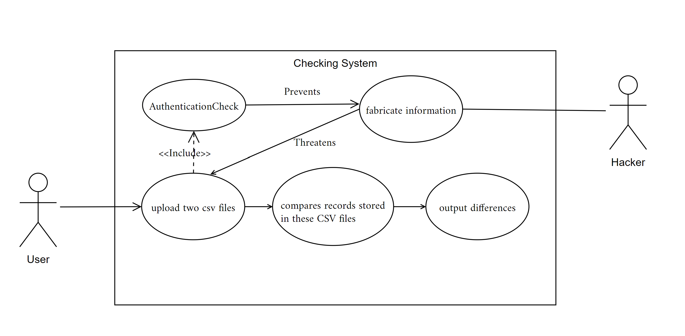

## Week 8 Task - Tester

### Problem Description

Consider a CSV file that stores a list of records (e.g., records of bank accounts). You are required to write a software program that reads two such CSV files, compares records stored in these CSV files row by row against a unique combination and records all mismatches as exceptions. Finally, the software program generates another csv file listing the exceptions.

### Use Case Diagram

### How to Run the Program

Download this project and open it in any JAVA environment. Firstly, run `Main.java` and see the example of comparing `sample_file_1.csv` and `sample_file_3.csv` under the main directory. The comparing result is output as `test_file_comparing_1_and_3.csv`.

You can also run it with specified filenames `comparingFileA.csv`, `comparingFileB.csv` and `fileOutput.csv` in terms of `Tester.test(comparingFileA.csv, comparingFileB.csv, fileOutput.csv);`.

